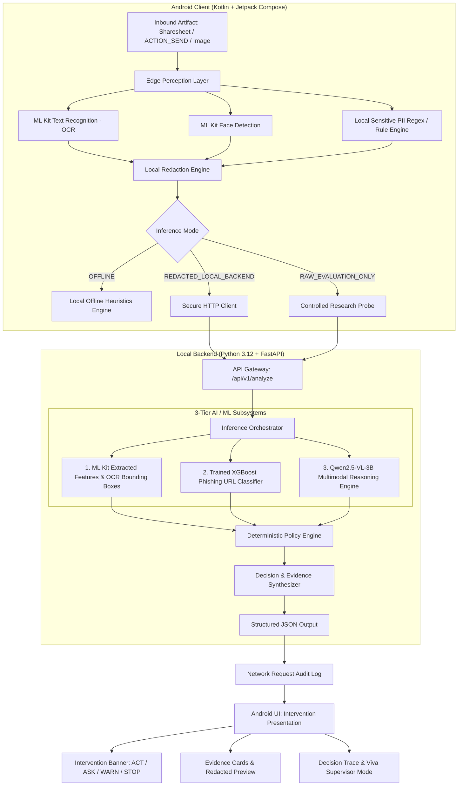
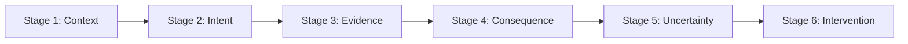

# ContextGuard System Architecture

## 1. System Overview & Research Framing

ContextGuard is an **action-conditioned pre-action digital safety system**. Traditional security systems (such as spam filters, virus scanners, or static phishing detectors) assess risk based solely on the artifact itself:

$$\text{Risk}_{\text{traditional}} = f(\text{Artifact})$$

In real-world mobile workflows, the risk of an artifact is fundamentally inseparable from the user's intended action and destination context. ContextGuard models safety as:

$$\text{Risk}_{\text{ContextGuard}} = \mathcal{P}(\text{Artifact} + \text{Context} + \text{Intended Action} + \text{Evidence} + \text{Consequence} + \text{Uncertainty})$$

The system computes a deterministic risk score $\rho$ and maps it to exactly one safety intervention:
- **ACT** (Green): Safe to proceed; negligible or well-bounded risk.
- **ASK** (Yellow): Ambiguous context, elevated uncertainty, or incomplete evidence; user confirmation with clarifying rationale required.
- **WARN** (Orange): Detectable risk with reversible or moderate consequences; explicit hazard warning presented before proceeding.
- **STOP** (Red): Severe, critical, or irreversible harm detected; action blocked by default (with intentional emergency user override).

---

## 2. Layered Architecture

The system consists of two primary operational nodes: the **Android Client** (Edge Perception & User Interaction) and the **Local Backend** (Inference Orchestration & Deterministic Policy).



---

## 3. The 3 AI/ML Layers

### Layer 1: Edge Perception (Google ML Kit & Local PII Engine)
- **OCR (Text Recognition):** Runs entirely on-device via Google Play Services / ML Kit bundled vision API. Extracts text lines, blocks, and normalized bounding boxes.
- **Face Detection:** Detects human facial contours and bounding coordinates to flag identity disclosure.
- **Local PII Detector & Redactor:** Detects sensitive account patterns, phone numbers, email addresses, and names locally. Applies visual pixel masking / black-box redaction and in-memory text token masking (e.g. `[REDACTED_ACCOUNT]`).

### Layer 2: Trained XGBoost Phishing URL Classifier
- **Model:** Gradient boosted decision trees trained on the genuine public **PhiUSIIL Phishing URL Dataset** (UCI ML Repository).
- **Feature Pipeline:** 35+ strictly derived lexical and structural features (e.g., URL length, Shannon entropy, domain hyphens, subdomain count, TLD risk, presence of IP address, suspicious token ratios).
- **Parity Guarantee:** The feature extractor module (`ml.features.url_features`) is identical between offline dataset training and runtime inference.
- **Artifact:** Exported model weights at [`ml/artifacts/url_risk_model.joblib`](file:///c:/Users/GARV%20ANAND/Downloads/Krish%20project/Context-Gaurd/ml/artifacts/url_risk_model.joblib) and parameters at [`ml/artifacts/url_model_metadata.json`](file:///c:/Users/GARV%20ANAND/Downloads/Krish%20project/Context-Gaurd/ml/artifacts/url_model_metadata.json).
- **Service Layer:** [`backend/services/url_risk.py`](file:///c:/Users/GARV%20ANAND/Downloads/Krish%20project/Context-Gaurd/backend/services/url_risk.py).

### Layer 3: Multimodal Vision-Language Reasoning (Qwen2.5-VL-3B)
- **Model:** `Qwen2.5-VL-3B-Instruct` (target Ollama tag: `qwen2.5vl:3b` / `qwen2.5-vl:3b`) served locally via Ollama. No paid external APIs.
- **Backend Abstraction:**
  - Base interface: `VisionReasoner.analyze(...)` in [`backend/models/base.py`](file:///c:/Users/GARV%20ANAND/Downloads/Krish%20project/Context-Gaurd/backend/models/base.py).
  - Concrete implementation: `QwenVisionReasoner` in [`backend/models/qwen_vision.py`](file:///c:/Users/GARV%20ANAND/Downloads/Krish%20project/Context-Gaurd/backend/models/qwen_vision.py).
- **Strict Structured JSON Contract:**
  - Free-form prose is explicitly forbidden as the backend contract.
  - Returns `StructuredVisionOutput`:
    - `context_summary`: String summary of the artifact domain and layout.
    - `intent_assessment`: Evaluation of the intended action and destination channel.
    - `evidence`: List of `{type, description, importance}` items.
    - `risk_type` & `risk_subtype`: Fine-grained hazard taxonomy classification.
    - Bounded numerical metrics: $\text{severity} \in [0.0, 1.0]$, $\text{reversibility} \in [0.0, 1.0]$, $\text{confidence} \in [0.0, 1.0]$.
    - `uncertainty_reasons`: Explicit epistemic uncertainty factors.
    - `recommended_action`: `ACT`, `ASK`, `WARN`, or `STOP`.
    - `alternative_action`: Optional safe path guidance.
    - `reason`: Concrete grounding and rationale.
- **Immutable Versioned Prompts:**
  - Located under `backend/prompts/`: `context_v1.txt`, `intent_v1.txt`, `evidence_v1.txt`, `consequence_v1.txt`, `uncertainty_v1.txt`, `reasoning_v1.txt`.
  - Prompts ground model reasoning in perceptual observations, distinguish artifact risk from action risk, and mandate reporting uncertainty without hallucination.
- **In-Memory Image Normalizer:**
  - Supports JPEG, PNG, WebP. Enforces a 10 MB payload limit and 1536px dimension bound.
  - Normalizes color channels and formats entirely in volatile memory; zero raw images persisted to disk.
- **Resilient Fallback & Model Health:**
  - Safe deterministic action-conditioned fallback is engaged whenever Ollama is offline or unparseable, adhering to the **Model Failure Safety Rule** (never silently emits `ACT`).
  - Endpoint `GET /health/models` provides authentic telemetry: `ollama_reachable`, `model_installed`, `model_name`, `startup_latency`, `test_inference_status`, and `vlm_healthy`. Model health is never fabricated.

---

## 4. The Six-Stage ContextGuard Reasoning Pipeline

The pre-action safety assessment is executed through a strictly sequenced, six-stage pipeline:



### Stage 1: Context Aggregation
Combines artifact characteristics, OCR text, face contours, PII entities, source app, recipient, destination, and network state.
- **Missing Field Rule:** Unavailable fields are explicitly represented as `None` or `"UNKNOWN"` without hallucinating facts.

### Stage 2: Intent Resolution
- **Primary Demo Mode:** User explicitly selects one of the 8 canonical actions: `SEND`, `UPLOAD`, `POST`, `SIGN`, `LOGIN`, `APPROVE`, `SAVE`, `OPEN`.
- **Inferred Intent Mode:** Infers intent from destination/context signals for research benchmarking.
- **Strict Precedence Invariant:** Inferred intent never silently overrides an explicitly selected user action.

### Stage 3: Action-Relevant Evidence Extraction
Extracts concrete observations with strict source traceability:
- `OCR`: Financial balances, credentials, OTP codes, tax IDs, binding legal clauses, urgency lures.
- `ML_KIT`: Human faces detected, on-device regex PII entities.
- `URL_MODEL`: XGBoost classifier malicious/phishing probability.
- `VLM`: Multimodal visual perception and spatial grounding.
- `CONTEXT`: Unverified recipients, public destination channels, network exposure.
- `RULE`: Consequential action heuristics.

### Stage 4: Consequence Estimation (Separate Severity & Reversibility)
Estimates harm severity $s \in [0.0, 1.0]$ and irreversibility $r \in [0.0, 1.0]$ independently:
- **Action-Conditioning Core:**
  - Identical bank statement + `SAVE` in personal vault $\implies s = 0.05, r = 0.00$ (Low harm, fully reversible).
  - Identical bank statement + `SEND` to unverified contact $\implies s = 0.40, r = 0.50$ (Moderate risk).
  - Identical bank statement + `POST` to public Twitter $\implies s = 0.90, r = 1.00$ (Severe harm, completely irreversible).

### Stage 5: Epistemic Uncertainty Estimation
Computes confidence $c \in [0.0, 1.0]$ based on signal completeness, OCR availability, recipient verifiability, and model agreement.
- **Uncertainty Principle:** Uncertainty is never treated as safety. Moderate risk with low confidence triggers `ASK`.

### Stage 6: Deterministic Policy Intervention & Grounded Explanation
Computes $\rho = s \times (1 + \lambda \times r)$ and applies calibrated mathematical thresholds:
- $T_{\text{STOP}} = 0.65$
- $T_{\text{ASK}} = 0.35$
- $C_{\text{MIN}} = 0.70$
- $T_{\text{HIGH\_SEV}} = 0.80$ (Severe/critical risk triggers `STOP` regardless of lower confidence).

```text
if rho >= T_STOP:
    if severity >= T_HIGH_SEV or confidence >= C_MIN:
        INTERVENTION = STOP
    else:
        INTERVENTION = ASK
else if rho >= T_ASK:
    if confidence < C_MIN:
        INTERVENTION = ASK
    else:
        INTERVENTION = WARN
else:
    if confidence < C_MIN:
        INTERVENTION = ASK
    else:
        INTERVENTION = ACT
```

### Deterministic Explanation Synthesis
User-facing reasons and recommended alternatives are synthesized directly from mathematical decision fields and top evidence items (`backend/policy/explain.py`). No secondary LLM is invoked, guaranteeing deterministic and grounded explanations.

### Model Failure Safety Rule
**Fail-Safe Invariant:** If AI models, parsers, or pipeline stages fail or return out-of-bounds metrics:
$$\text{Output} \leftarrow \text{ASK with safe fallback defaults} \quad (\text{NEVER } \text{ACT})$$

---

## 5. Three Operational Inference Modes

1. **OFFLINE:**
   - Zero outbound network traffic.
   - On-device ML Kit OCR and regex/heuristic analysis.
   - Deterministic structural URL heuristics.
   - Ambiguous or high-hazard cases automatically yield **ASK**.
2. **REDACTED_LOCAL_BACKEND (Default Live Demo Mode):**
   - On-device PII and faces are masked prior to transmission.
   - Redacted image and structured metadata sent over local loopback (`http://10.0.2.2:8000` from Android emulator or `http://localhost:8000` / local LAN).
   - Backend runs XGBoost URL classifier and Qwen2.5-VL-3B.
   - Deterministic policy enforces intervention.
3. **RAW_EVALUATION_ONLY:**
   - Dedicated strictly for controlled academic benchmark validation and ablation studies.
   - Never used during normal end-user flows.
   - Clearly flagged in logs and responses.

---

## 6. Privacy & Threat Architecture

- **No Raw Artifact Persistence:** Uploaded files or camera buffers are held only in volatile memory during analysis.
- **SHA-256 Telemetry:** Log entries and audit records identify artifacts solely by cryptographic digest `SHA-256(artifact)`.
- **Transparent Network Audit:** Android client features a dedicated Network Log screen displaying exact byte payload, endpoint, timestamp, and redaction verification.
- **Local Execution:** All backend endpoints and inference run locally on the host workstation.

---

## 7. The Central Viva Demonstration
To showcase action-conditioning, ContextGuard utilizes a single synthetic bank statement artifact across three distinct actions:

| Action Scenario | Target Recipient / Channel | Severity ($s$) | Irreversibility ($r$) | Risk ($\rho$) | Resulting Intervention |
| :--- | :--- | :--- | :--- | :--- | :--- |
| **Action 1** | Save to Personal Encrypted Vault | $0.05$ | $0.00$ | $0.05$ | **ACT** (Green) |
| **Action 2** | Send to Unverified Contact via Chat | $0.45$ | $0.50$ | $0.62$ | **WARN** or **ASK** (Orange/Yellow) |
| **Action 3** | Post to Public Social Media Feed | $0.90$ | $1.00$ | $1.57$ | **STOP** (Red) |

This visual demonstration validates the core thesis: **The artifact remains constant, but the intervention adapts dynamically to action and context.**
