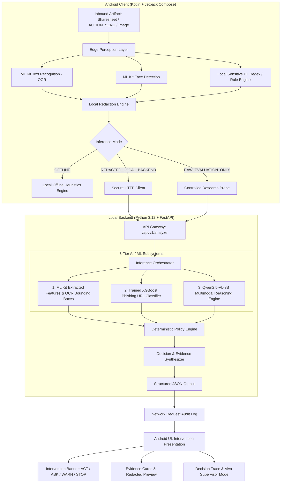

# ContextGuard System Architecture

## 1. System Overview & Research Framing

ContextGuard is an **action-conditioned pre-action digital safety system**. Traditional security systems (such as spam filters, virus scanners, or static phishing detectors) assess risk based solely on the artifact itself:

$$\text{Risk}_{\text{traditional}} = f(\text{Artifact})$$

In real-world mobile workflows, the risk of an artifact is fundamentally inseparable from the user's intended action and destination context. ContextGuard models safety as:

$$\text{Risk}_{\text{ContextGuard}} = \mathcal{P}(\text{Artifact} + \text{Context} + \text{Intended Action} + \text{Evidence} + \text{Consequence} + \text{Uncertainty})$$

The system computes a deterministic risk score $\rho$ and maps it to exactly one safety intervention:
- **ACT** (Green): Safe to proceed; negligible or well-bounded risk.
- **ASK** (Yellow): Ambiguous context, elevated uncertainty, or incomplete evidence; user confirmation with clarifying rationale required.
- **WARN** (Orange): Detectable risk with reversible or moderate consequences; explicit hazard warning presented before proceeding.
- **STOP** (Red): Severe, critical, or irreversible harm detected; action blocked by default (with intentional emergency user override).

---

## 2. Layered Architecture

The system consists of two primary operational nodes: the **Android Client** (Edge Perception & User Interaction) and the **Local Backend** (Inference Orchestration & Deterministic Policy).



---

## 3. The 3 AI/ML Layers

### Layer 1: Edge Perception (Google ML Kit & Local PII Engine)
- **OCR (Text Recognition):** Runs entirely on-device via Google Play Services / ML Kit bundled vision API. Extracts text lines, blocks, and normalized bounding boxes.
- **Face Detection:** Detects human facial contours and bounding coordinates to flag identity disclosure.
- **Local PII Detector & Redactor:** Detects sensitive account patterns, phone numbers, email addresses, and names locally. Applies visual pixel masking / black-box redaction and in-memory text token masking (e.g. `[REDACTED_ACCOUNT]`).

### Layer 2: Trained XGBoost Phishing URL Classifier
- **Model:** Gradient boosted decision trees trained on the genuine public **PhiUSIIL Phishing URL Dataset** (UCI ML Repository).
- **Feature Pipeline:** 35+ strictly derived lexical and structural features (e.g., URL length, Shannon entropy, domain hyphens, subdomain count, TLD risk, presence of IP address, suspicious token ratios).
- **Parity Guarantee:** The feature extractor module (`ml.features.url_features`) is identical between offline dataset training and runtime inference.
- **Artifact:** Exported model weights at [`ml/artifacts/url_risk_model.joblib`](file:///c:/Users/GARV%20ANAND/Downloads/Krish%20project/Context-Gaurd/ml/artifacts/url_risk_model.joblib) and parameters at [`ml/artifacts/url_model_metadata.json`](file:///c:/Users/GARV%20ANAND/Downloads/Krish%20project/Context-Gaurd/ml/artifacts/url_model_metadata.json).
- **Service Layer:** [`backend/services/url_risk.py`](file:///c:/Users/GARV%20ANAND/Downloads/Krish%20project/Context-Gaurd/backend/services/url_risk.py).

### Layer 3: Multimodal Vision-Language Reasoning (Qwen2.5-VL-3B)
- **Model:** `Qwen2.5-VL-3B-Instruct` served locally via Ollama or local inference wrapper.
- **Input:** Redacted artifact image + extracted text + contextual metadata (source app, intended action, recipient, destination).
- **Output:** Structured JSON schema predicting severity $s \in [0, 1]$, reversibility $r \in [0, 1]$, confidence $c \in [0, 1]$, identified hazard categories, evidence snippets, and rationale.

---

## 4. Deterministic Policy Engine

The policy layer is purely deterministic and separates raw AI scoring from final safety action gating.

### Mathematical Formulation
Given:
- **Severity** $s \in [0, 1]$ (predicted hazard magnitude)
- **Irreversibility** $r \in [0, 1]$ (difficulty of undoing consequences: $0.0 = \text{fully reversible}, 0.5 = \text{partially}, 1.0 = \text{irreversible}$)
- **Confidence** $c \in [0, 1]$ (model epistemic and aleatoric confidence)
- **Reversibility Weight Penalty** $\lambda \ge 0$ (default $\lambda = 0.75$)

The composite risk score $\rho$ is computed as:
$$\rho = s \times (1 + \lambda \times r)$$

### Decision Threshold Rules
With calibrated thresholds:
- $T_{\text{STOP}} = 0.65$
- $T_{\text{ASK}} = 0.35$
- $C_{\text{MIN}} = 0.70$

```text
if rho >= T_STOP:
    INTERVENTION = STOP
else if rho >= T_ASK and confidence < C_MIN:
    INTERVENTION = ASK
else if rho >= T_ASK:
    INTERVENTION = WARN
else:
    INTERVENTION = ACT
```

### Model Failure Safety Rule
**Fail-Safe Invariant:** If AI output is invalid, missing, malformed, unparseable, or inconsistent:
$$\text{Output} \leftarrow \text{ASK or Safe Fallback} \quad (\text{NEVER } \text{ACT})$$

---

## 5. Three Operational Inference Modes

1. **OFFLINE:**
   - Zero outbound network traffic.
   - On-device ML Kit OCR and regex/heuristic analysis.
   - Deterministic structural URL heuristics.
   - Ambiguous or high-hazard cases automatically yield **ASK**.
2. **REDACTED_LOCAL_BACKEND (Default Live Demo Mode):**
   - On-device PII and faces are masked prior to transmission.
   - Redacted image and structured metadata sent over local loopback (`http://10.0.2.2:8000` from Android emulator or `http://localhost:8000` / local LAN).
   - Backend runs XGBoost URL classifier and Qwen2.5-VL-3B.
   - Deterministic policy enforces intervention.
3. **RAW_EVALUATION_ONLY:**
   - Dedicated strictly for controlled academic benchmark validation and ablation studies.
   - Never used during normal end-user flows.
   - Clearly flagged in logs and responses.

---

## 6. Privacy & Threat Architecture

- **No Raw Artifact Persistence:** Uploaded files or camera buffers are held only in volatile memory during analysis.
- **SHA-256 Telemetry:** Log entries and audit records identify artifacts solely by cryptographic digest `SHA-256(artifact)`.
- **Transparent Network Audit:** Android client features a dedicated Network Log screen displaying exact byte payload, endpoint, timestamp, and redaction verification.
- **Local Execution:** All backend endpoints and inference run locally on the host workstation.

---

## 7. The Central Viva Demonstration
To showcase action-conditioning, ContextGuard utilizes a single synthetic bank statement artifact across three distinct actions:

| Action Scenario | Target Recipient / Channel | Severity ($s$) | Irreversibility ($r$) | Risk ($\rho$) | Resulting Intervention |
| :--- | :--- | :--- | :--- | :--- | :--- |
| **Action 1** | Save to Personal Encrypted Vault | $0.05$ | $0.00$ | $0.05$ | **ACT** (Green) |
| **Action 2** | Send to Unverified Contact via Chat | $0.45$ | $0.50$ | $0.62$ | **WARN** or **ASK** (Orange/Yellow) |
| **Action 3** | Post to Public Social Media Feed | $0.90$ | $1.00$ | $1.57$ | **STOP** (Red) |

This visual demonstration validates the core thesis: **The artifact remains constant, but the intervention adapts dynamically to action and context.**
