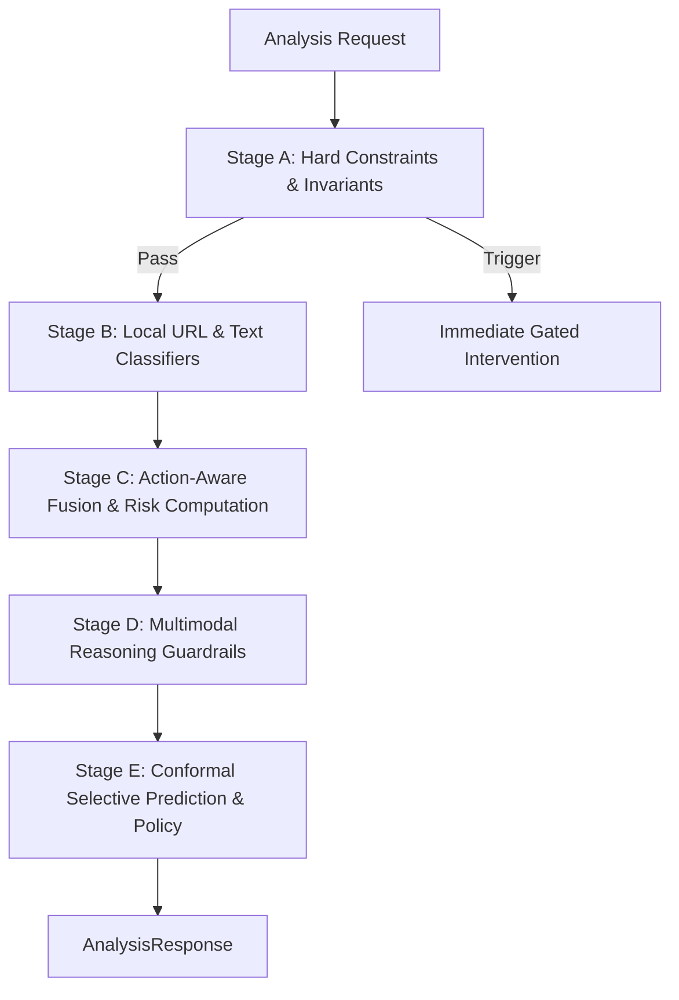

# ContextGuard Decision & Uncertainty Engine Specification

**Document Version:** 2.1.0  
**Status:** Canonical Academic Specification & Production Architecture  
**Subsystem:** `backend.policy` & `backend.app.models`  
**Classification:** Pre-Action Mobile Risk Mitigation Engine  

---

## 1. Executive Summary

ContextGuard introduces an action-aware, calibrated decision and uncertainty engine designed for pre-action mobile defense. Rather than treating digital artifacts (e.g., bank statements, credentials, verification codes) as possessing static intrinsic risks, ContextGuard models risk as an **action-conditioned consequence**:

$$\text{Risk}(\rho) = \text{Severity}(s) \times \left(1 + \lambda \times \text{Irreversibility}(r)\right)$$

This specification formalizes the canonical evidence model, action-conditioned state representation, 5-stage calibrated cascade architecture, split conformal selective prediction mechanism, and deterministic intervention policy layer.

---

## 2. Canonical Evidence Model

### 2.1 Schema Definition
All perceptual, lexical, structural, and model-derived signals are normalized into a strongly typed, immutable record: `CanonicalEvidenceRecord` ([`evidence.py`](file:///c:/Users/GARV%20ANAND/Downloads/Krish%20project/Context-Gaurd/backend/app/models/evidence.py)).

| Field | Type | Description |
| :--- | :--- | :--- |
| `evidence_id` | `str` | Unique deterministic identifier (e.g., `ev_ocr_001`, `ev_url_002`) |
| `category` | `str` | Categorical hazard taxonomy: `financial`, `credential`, `otp`, `url_risk`, `personal_id`, `confidential_memo` |
| `summary` | `str` | Privacy-safe semantic description; raw sensitive secrets are permanently scrubbed |
| `observed_value` | `Optional[str]` | Sanitized token observation or sanitized indicator |
| `provenance_source` | `EvidenceProvenanceSource` | Originating subsystem: `ML_KIT_OCR`, `ML_KIT_FACE`, `ACCESSIBILITY_TREE`, `NOTIFICATION`, `URL_MODEL`, `MESSAGE_MODEL`, `USER_CONFIRMED_CONTEXT`, `VLM`, `RULE` |
| `epistemic_type` | `EpistemicEvidenceType` | Grounded epistemic nature: `OBSERVED_EVIDENCE`, `DERIVED_INFERENCE`, `USER_SUPPLIED_CONTEXT`, `MISSING_EVIDENCE` |
| `extractor_version`| `str` | Versioned extractor tag (e.g., `mlkit_ocr_v16`, `xgb_phiusiil_v1.1`, `system_v2`) |
| `confidence` | `Optional[float]` | Calibrated component confidence in $[0.0, 1.0]$ when genuinely supported |
| `timestamp` | `str` | ISO 8601 UTC timestamp of signal extraction |
| `relevant_action` | `Optional[str]` | The user action modulated by this evidence (e.g., `SEND`, `POST`, `LOGIN`, `APPROVE`) |
| `severity_contribution`| `float` | Direct hazard contribution magnitude in $[0.0, 1.0]$ |
| `reliability_limitations`| `Optional[str]` | Documented sensor failure modes and blind spots (e.g., adversarial cloaking, OCR contrast degradation) |

### 2.2 Privacy Preservation Invariants
1. **Zero Secret Persistence:** Raw 12-digit Aadhaar identifiers, 16-digit payment card PANs, passwords, and raw numeric OTP tokens are filtered prior to record instantiation via regex sanitization masks (`[REDACTED_AADHAAR]`, `[REDACTED_CARD]`, `[REDACTED_OTP]`).
2. **Explicit Missing Evidence:** When a modality cannot be observed (e.g., OCR fails or image is absent), ContextGuard creates an explicit `MISSING_EVIDENCE` record. Missing context elevates epistemic uncertainty rather than implying safety.
3. **Non-Hallucination Invariant:** Vision-Language Models (VLMs) and neural extractors are strictly prohibited from inventing missing recipient identities, transaction amounts, or destinations.

---

## 3. Action-Conditioned State Representation

### 3.1 Feature Formulation
The pre-action state is formalized as `ActionConditionedState` ([`action_state.py`](file:///c:/Users/GARV%20ANAND/Downloads/Krish%20project/Context-Gaurd/backend/app/models/action_state.py)), capturing the relational context between the artifact and the user's intended operation:

* **Selected / Inferred Action:** Canonical user action from the action taxonomy.
* **Intended Recipient:** Verified contact identity or explicit `UNKNOWN_RECIPIENT`.
* **Destination Scope:** Spatial exposure boundary (`PRIVATE_VAULT`, `DIRECT_MESSAGE_KNOWN`, `DIRECT_MESSAGE_UNKNOWN`, `PUBLIC_FEED`, `EXTERNAL_PORTAL`, `PAYMENT_GATEWAY`, `UNKNOWN`).
* **Public / Private Destination:** Boolean indicator of third-party public broadcast exposure.
* **Recipient Trust Verification:** Strict invariant: **Unknown recipients remain unknown**. Visible persona strings (e.g., "Vikram", "Support Desk") do not confer trust without independent out-of-band verification.
* **Sensitivity ($S_{\text{art}}$):** Intrinsic consequence of artifact compromise.
* **Severity of Potential Harm ($s$):** Action-conditioned harm magnitude in $[0.0, 1.0]$.
* **Irreversibility ($r$):** Permanence of external dissemination in $[0.0, 1.0]$ ($r=0.0$ for local storage; $r=1.0$ for public broadcast or financial clearing).
* **Evidence Reliability & Uncertainty ($u$):** Aggregate epistemic ambiguity measure.

### 3.2 Action Taxonomy Support
ContextGuard explicitly gates nine core action types:
1. `KEEP_LOCALLY` / `SAVE`: Local archival within private encrypted storage ($r=0.0$).
2. `SEND_PRIVATELY` / `SEND_TO_KNOWN`: Encrypted peer-to-peer transmission to verified contact ($r=0.4$).
3. `SEND_UNKNOWN_RECIPIENT` / `SEND`: Egress to unverified or external recipient ($r=0.7$).
4. `POST_PUBLICLY` / `POST`: Irreversible broadcast to public internet feed ($r=1.0$).
5. `OPEN_URL`: Navigation to external web destination.
6. `ENTER_CREDENTIALS` / `LOGIN`: Form submission of authentication secrets ($r=0.9$).
7. `APPROVE_PAYMENT` / `APPROVE`: Authorization of financial fund transfer ($r=1.0$).
8. `UPLOAD_DOCUMENT`: External multi-part form upload.
9. `SIGN_DOCUMENT`: Legal or digital non-repudiation commitment.

---

## 4. The Five-Stage Calibrated Cascade Architecture

ContextGuard executes a fast, layered inference cascade ([`cascade_engine.py`](file:///c:/Users/GARV%20ANAND/Downloads/Krish%20project/Context-Gaurd/backend/policy/cascade_engine.py)):



### 4.1 Stage A: Deterministic Evidence Checks and Hard Constraints
* **Safe Local Vault Archival:** `SAVE` / `KEEP_LOCALLY` targeted at personal encrypted vaults bypasses external network evaluation and immediately outputs `ACT`.
* **Protective Refusal Actions:** Safety refusals (`DECLINE`, `BACK_TO_SAFETY`, `REPORT_PHISH`) output `ACT` (safe refusal).
* **Public Secret Broadcast Constraint:** Public feed dissemination of unredacted credentials, OTPs, or financial statements immediately triggers `STOP`.

### 4.2 Stage B: Locally Executed URL and Text Classifiers
* **Portable XGBoost URL Classifier:** Runs 20-feature lexical/structural evaluation (`ml/artifacts/url_model_portable.json`). Calibrated output is bounded to $[0.05, 0.95]$ to enforce that an empirical 0.99 score is never treated as 100% real-world certainty.
* **On-Device Lexical & PII Classifiers:** ML Kit OCR and regex extractors detect OTPs, credentials, national IDs, and privileged corporate memos.
* **Unavailable Sensor Fallback:** If any local model fails or encounters corrupt input, it emits `MISSING_EVIDENCE` with safe default confidence ($c=0.10$).

### 4.3 Stage C: Action-Aware Fusion and Calibration
* **Transparent Deterministic Fusion:** Given small sample sizes in frontier safety benchmarks, ContextGuard retains transparent, deterministic mathematical fusion rather than overfitting a complex neural aggregator.
* Computes severity $s$, reversibility $r$, and composite risk $\rho = s \cdot (1 + \lambda r)$.

### 4.4 Stage D: Multimodal Reasoning Guardrails
* **VLM Non-Override Invariant:** Deep multimodal reasoning (Qwen 2.5-VL 3B) provides structured explanations and visual grounding. However, **the VLM cannot independently override the deterministic policy** or downgrade a severe evidenced risk to `ACT`.

### 4.5 Stage E: Deterministic Policy and Conformal Gating
* Combines mathematical risk thresholds with Split Conformal Prediction sets to output `STOP`, `ASK`, `WARN`, or `ACT`.

---

## 5. Split Conformal Prediction & Selective Prediction

### 5.1 Conformal Set Construction
Using a genuinely disjoint calibration partition ($D_{\text{cal}}$: 42 pairs across 14 base artifacts in `split == 'dev'`), the calibrator computes non-conformity scores:

$$s_i = 1 - \hat{p}(y_i \mid x_i)$$

For significance level $\alpha \in (0, 1)$ (default $\alpha = 0.10$, 90% target coverage), the empirical conformal quantile $\hat{q}$ is calculated:

$$\hat{q} = \text{Quantile}\left(\{s_i\}_{i=1}^n, \frac{\lceil (n+1)(1-\alpha) \rceil}{n}\right)$$

For test input $x$, the conformal prediction set is:

$$C(x) = \{y \in \{\text{ACT}, \text{WARN}, \text{ASK}, \text{STOP}\} : 1 - \hat{p}(y \mid x) \le \hat{q}\}$$

### 5.2 Selective Classification Rule
1. **Unambiguous Acceptance ($|C(x)| = 1$):**
   * If $C(x) = \{y^*\}$ and $y^* \neq \text{ASK}$, the decision is accepted without human abstention.
2. **Ambiguity Escalation ($|C(x)| > 1$ or $|C(x)| = 0$):**
   * If the conformal set contains multiple plausible labels or is empty (outlier distribution), the system abstains from autonomous action and issues **`ASK`**.
3. **High-Severity Override Safeguard:**
   * If $\text{STOP} \in C(x)$ and evidenced severity $s \ge 0.80$ (or hard constraint applies), the decision is strictly enforced as **`STOP`**. Severe potential harm is never downgraded to `ASK` or `ACT`.
4. **Epistemic Uncertainty Invariant:**
   * If confidence $c < 0.70$, the policy escalates to **`ASK`**.

### 5.3 Finite-Sample Limitations & Assumptions
* **Exchangeability:** Exact marginal coverage guarantees hold under exchangeability between calibration and test distributions. Because base artifacts represent clustered real-world scenarios, base-artifact disjointness is enforced to prevent optimistic data leakage. Grouped covariate shift across artifact categories may cause empirical coverage to deviate slightly from nominal $1 - \alpha$.

---

## 6. Deterministic Policy Layer

The mathematical decision gating enforces:

```python
# Rule A: High severity override
if rho >= stop_threshold:
    if s >= high_severity_override_threshold or c >= min_confidence_threshold:
        intervention = "STOP"
    else:
        intervention = "ASK"

# Rule B: Moderate risk
elif rho >= ask_threshold:
    if c < min_confidence_threshold or is_ambiguous:
        intervention = "ASK"
    else:
        intervention = "WARN"

# Rule C: Low risk
else:
    if c < min_confidence_threshold:
        intervention = "ASK"  # Uncertainty is NEVER treated as safety!
    else:
        intervention = "ACT"
```

### Threshold Parameters
* Reversibility weight: $\lambda = 0.75$
* Stop threshold: $\tau_{\text{stop}} = 0.65$
* Ask threshold: $\tau_{\text{ask}} = 0.35$
* Minimum confidence threshold: $\tau_{\text{conf}} = 0.70$
* High-severity override threshold: $\tau_{\text{override}} = 0.80$

---

## 7. Model Failure Safety Rule

If any parser, ML model, or network subsystem throws an unhandled exception or outputs malformed/corrupt metrics:
* **The system NEVER silently returns `ACT`.**
* It emits **`ASK`** with elevated epistemic uncertainty ($c=0.10, s=0.50, r=0.50$).
* A structured safeguard evidence item is attached detailing the error.
