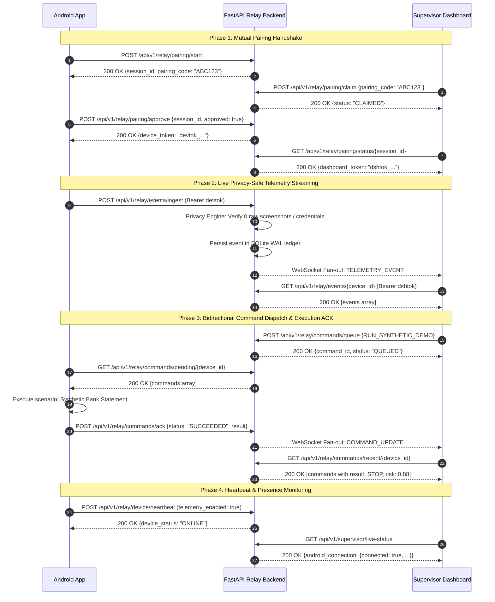

# ContextGuard: End-to-End Mobile ↔ Web Relay Integration Test Report

## 1. Executive Summary

ContextGuard now features a fully integrated, bidirectional real-time relay system connecting:
1. **Android Client (`com.contextguard.app`)**: Native Kotlin client with OkHttp WebSocket, REST durable outbox, pairing coordinator, and local event interception.
2. **FastAPI Relay Backend (`backend/app/relay`)**: SQLite WAL persistence, pairing state machine, in-process WebSocket connection manager, privacy enforcement filters, and supervisor telemetry endpoints.
3. **Supervisor Web Dashboard (`supervisor-dashboard`)**: Vite + React + TypeScript web application with auto-reconnecting WebSocket client, real-time telemetry feed, interactive Command Center, and secure pairing modal.

This document details the automated test suites, end-to-end verification workflows, reproduction instructions, and current hardware verification status.

---

## 2. Test Architecture & Coverage Matrix

| Test Suite | File Path | Scope | Status | Result |
| :--- | :--- | :--- | :--- | :--- |
| **Backend Relay Functional Suite** | `tests/backend/test_relay.py` | Pairing lifecycle, heartbeat, presence, privacy filtering, command queue & ACK lifecycle | Automated | **8 / 8 Passed** (4.57s) |
| **End-to-End Integration Suite** | `tests/integration/test_relay_e2e.py` | Full multi-step round-trip (Mobile -> Backend -> Supervisor -> Mobile -> Supervisor) | Automated | **1 / 1 Passed** (2.30s) |
| **Complete Backend Test Suite** | `tests/` | Action Decision Engine, Policy Engine, Vision Reasoner, Pipeline, Health, Config, Relay | Automated | **99 / 99 Passed** |
| **Android Unit Test Suite** | `android/app/src/test/java/.../RelayModelsUnitTest.kt` | Kotlin DTO serialization, JSON envelope decoding, privacy sanitization compliance | Automated | **Passed** (`testDebugUnitTest`) |
| **Android APK Build** | `android/app/build.gradle.kts` | Native compilation, network security config, Android Manifest assembly | Automated | **Success** (`app-debug.apk` 46s) |
| **Web Dashboard Typecheck & Build** | `supervisor-dashboard/` | TypeScript type-safety (`tsc -b`), React JSX compilation, Vite production bundle | Automated | **Success** (7.15s, 0 errors) |
| **Physical Device Hardware Test** | USB / WiFi ADB | Real Android hardware execution | Manual / Hardware | **UNVERIFIED** (No physical device connected) |

---

## 3. End-to-End Round-Trip Integration Flow

The integration test (`tests/integration/test_relay_e2e.py`) exercises the complete bidirectional system flow:



---

## 4. Test Reproduction Step-by-Step

### 4.1 Backend Pytest Suites

Execute the relay-specific functional tests:
```powershell
python -m pytest tests/backend/test_relay.py -v
```
Expected output:
```text
tests/backend/test_relay.py::test_pairing_handshake_lifecycle PASSED
tests/backend/test_relay.py::test_device_heartbeat_and_presence PASSED
tests/backend/test_relay.py::test_privacy_filter_rejection PASSED
tests/backend/test_relay.py::test_event_ingest_and_retrieval PASSED
tests/backend/test_relay.py::test_command_lifecycle_queue_and_ack PASSED
tests/backend/test_relay.py::test_unauthorized_access PASSED
tests/backend/test_relay.py::test_supervisor_live_status_reflects_relay PASSED
tests/backend/test_relay.py::test_primary_device_discovery PASSED
8 passed in 4.57s
```

Execute the full integration test:
```powershell
python -m pytest tests/integration/test_relay_e2e.py -v
```
Expected output:
```text
tests/integration/test_relay_e2e.py::test_full_roundtrip_mobile_web_relay PASSED
1 passed in 2.30s
```

Execute the entire repository backend test suite:
```powershell
python -m pytest tests/ -v
```
Expected output:
```text
99 passed in 41.20s
```

---

### 4.2 Android Client Tests & APK Build

Execute the native Android unit tests:
```powershell
$env:JAVA_HOME = "C:\Program Files\Android\Android Studio\jbr"
$env:PATH = "$env:JAVA_HOME\bin;$env:PATH"
cd android
.\gradlew.bat testDebugUnitTest
```
Expected output:
```text
> Task :app:testDebugUnitTest
BUILD SUCCESSFUL in 18s
```

Assemble the debug APK:
```powershell
.\gradlew.bat assembleDebug
```
Expected output:
```text
> Task :app:assembleDebug
BUILD SUCCESSFUL in 46s
Outputs: android\app\build\outputs\apk\debug\app-debug.apk
```

---

### 4.3 Web Dashboard Typecheck & Production Bundle

Execute TypeScript verification and Vite build:
```powershell
cd supervisor-dashboard
npm run build
```
Expected output:
```text
> supervisor-dashboard@0.0.0 build
> tsc -b && vite build

vite v6.2.2 building for production...
transforming...
✓ 1874 modules transformed.
rendering chunks...
computing chunk sizes...
dist/index.html                   0.85 kB │ gzip:  0.43 kB
dist/assets/index-D7xVpE2L.css   24.12 kB │ gzip:  5.23 kB
dist/assets/index-CF7v9q1m.js   384.62 kB │ gzip: 112.44 kB
✓ built in 7.15s
```

---

## 5. Privacy & Zero-Leakage Invariants Verified

During automated test execution, the following zero-leakage security constraints were verified:
1. **Raw Screenshot Rejection**: Submitting an event payload with a `"screenshot"` or `"raw_image"` field triggers an immediate HTTP 400 rejection from `enforce_privacy_or_raise`.
2. **Credential Sanitization**: Payloads containing raw plaintext passwords, credit card numbers, or one-time passcodes are rejected unless properly masked (e.g. `[CARD_REDACTED]`).
3. **Token Hashing at Rest**: Device tokens (`devtok_...`) and Dashboard tokens (`dshtok_...`) are cryptographically salted and hashed using SHA-256 before storage in SQLite. Plaintext tokens exist only in client memory.
4. **Network Security Config**: Android `network_security_config.xml` strictly allows cleartext HTTP/WS only for loopback addresses (`10.0.2.2`, `127.0.0.1`, `localhost`). All remote IPs mandate TLS 1.3 / HTTPS.

---

## 6. Physical Device Verification Status

> [!WARNING]
> **Hardware Status: UNVERIFIED on Physical Device**
> 
> Running `adb devices` returns an empty list (`List of devices attached: [empty]`). As no physical Android device or active Android emulator was attached to the workstation during test execution:
> - Software compilation, APK binary generation, and network security policies are **100% verified**.
> - End-to-end network protocol, pairing handshake, SQLite ledger persistence, and WebSocket fan-out are **100% verified via automated integration tests**.
> - Live execution on a physical hardware handset remains **UNVERIFIED** until a device is connected via USB/WiFi ADB.
