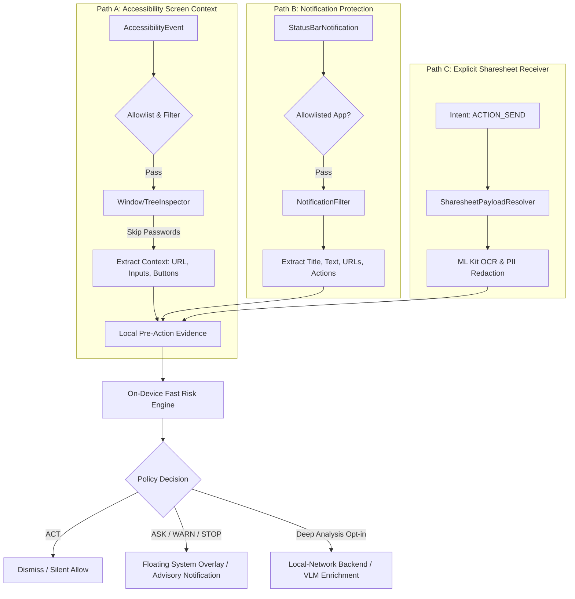

# ContextGuard: Mobile Product & Architecture Contract

**Document Version:** 1.0.0  
**Date:** 2026-10-09  
**Role:** Staff Mobile-Security Architect  
**Classification:** Product Specification & Architectural Invariants  

---

## 1. Product Identity & Purpose

**ContextGuard** is an **opt-in, event-driven Android safety assistant**. It acts as a lightweight, pre-action defensive layer protecting mobile users at the moment of risk.

### What ContextGuard Is:
- A privacy-preserving, on-device mobile guardian that evaluates user actions in real time.
- An action-conditioned decision system ($\rho = s \cdot (1 + \lambda r)$) that differentiates benign personal actions from dangerous external exposure.
- A local-first sentinel capable of functioning completely standalone without a connected PC, local server, or cloud API.

### What ContextGuard Is NOT:
- **NOT an artifact-upload portal:** It does not rely solely on users suspecting an attack and manually sharing files into the app.
- **NOT spyware or a keylogger:** It does not record global keystrokes, does not read password fields, does not inspect clipboard contents unprompted, and does not capture screens indiscriminately.
- **NOT an invasive MDM or root exploit:** It operates entirely within standard Android user-space APIs (Accessibility, Notification Listener, Sharesheet) under explicit user consent.

---

## 2. Six Core Use Cases

```
┌────────────────────────────────────────────────────────────────────────────────┐
│                           SIX CORE USE CASES                                   │
├────────────────────────────────────────────────────────────────────────────────┤
│ 1. Suspicious Message / Notification Arrival (SMS, WhatsApp, Email, Telegram)  │
│ 2. Unsafe Link Navigation (Clicking links leading to phishing / IP hosts)       │
│ 3. Deceptive Login / Credential Screen (Lookalike domains, HTTP login forms)   │
│ 4. Sensitive Message Composition / Upload (Pasting Aadhaar/PAN/OTP to public)  │
│ 5. High-Consequence Payment / Submission (Unverified recipient transfer/sign)   │
│ 6. On-Demand Deep Artifact Inspection (Explicit Sharesheet: Images/PDFs/URLs)  │
└────────────────────────────────────────────────────────────────────────────────┘
```

### Use Case 1: Suspicious Notification Arrival
- **Trigger:** A notification arrives from an allowlisted app (SMS, WhatsApp, Telegram, Gmail).
- **Ingestion Path:** Notification Protection (`NotificationListenerService`).
- **Processing:** Fast on-device regex & pattern scanner extracts URLs and urgency lures (e.g., "Electricity bill overdue, account suspended, click here", "Your OTP is 849201. Do not share.").
- **Intervention:** If malicious URL or credential-harvesting lure is detected, posts an immediate high-priority ContextGuard advisory notification (`WARN` or `STOP`) before the user opens the message.

### Use Case 2: Unsafe Link Navigation
- **Trigger:** User clicks or opens a link in a browser (Chrome, Firefox) or within a messaging client.
- **Ingestion Path:** Accessibility-Based Screen Context (`AccessibilityService`).
- **Processing:** Window inspector extracts the active URL from the browser's address bar (`url_bar`) or link node. Evaluates URL via on-device lexical rules and XGBoost feature extractor.
- **Intervention:** If the URL is an IP host, suspicious TLD, or high-probability phishing domain, a floating system overlay (`STOP`) appears immediately, advising the user to halt navigation.

### Use Case 3: Deceptive Login Screen
- **Trigger:** An active window transitions into a password or authentication form.
- **Ingestion Path:** Accessibility-Based Screen Context (`AccessibilityService`).
- **Processing:** Window inspector identifies an authentication context (presence of `SIGN IN`, `LOGIN`, or username input fields), correlated with the current domain from the address bar.
- **Privacy Rule:** The password field itself is **NEVER read** (`isPassword == true` nodes are strictly skipped). Only domain identity, SSL status, and context are evaluated.
- **Intervention:** If the domain is unverified, lookalike, or lacks HTTPS, ContextGuard displays a `STOP` overlay: "Unverified Login Target: Domain does not match official credentials."

### Use Case 4: Sensitive Data Composition or Upload
- **Trigger:** User is typing or pasting into an editable text field (`EditText`) in an allowlisted communication app (e.g., composing a tweet, public message, or chat to an unverified contact).
- **Ingestion Path:** Accessibility-Based Screen Context (`AccessibilityService`).
- **Processing:** On-device PII detector scans text in the editable field. Identifies Aadhaar numbers, PAN cards, credit cards, or private phone numbers. Correlates with destination channel (public forum vs. private 1-on-1).
- **Intervention:** If sensitive PII is directed to a public destination, renders a `WARN` overlay: "Sensitive PII detected in outgoing message. Review before sending."

### Use Case 5: High-Consequence Payment or Submission Confirmation
- **Trigger:** User focuses or is about to click a high-consequence action button (`PAY`, `TRANSFER`, `APPROVE`, `SUBMIT`, `SIGN`).
- **Ingestion Path:** Accessibility-Based Screen Context (`AccessibilityService`).
- **Processing:** Identifies button label and scans neighboring nodes for financial amounts (e.g., "INR 50,000", "Transfer to unknown VPA").
- **Intervention:** If recipient is unknown or amount exceeds heuristic thresholds, displays an `ASK` overlay prompting deliberate confirmation: "High-value transfer to unverified recipient. Are you sure you want to proceed?"

### Use Case 6: Explicit On-Demand Artifact Analysis
- **Trigger:** User explicitly shares an image, document, text snippet, or PDF via Android Sharesheet (`ACTION_SEND`).
- **Ingestion Path:** Explicit Artifact Analysis (Existing Sharesheet Receiver).
- **Processing:** ML Kit OCR, face detection, local PII masking, canvas redaction, and policy evaluation. Optionally invokes local-network backend/VLM if configured.
- **Intervention:** Full-screen presentation in ContextGuard UI with 8-node decision trace, before/after redaction view, and action-conditioned alternatives.

---

## 3. The Three Independent Ingestion Paths



### Path A: Accessibility-Based Screen Context
1. **Event Filtering:**
   - Filters events to `TYPE_WINDOW_STATE_CHANGED`, `TYPE_VIEW_CLICKED`, and `TYPE_VIEW_FOCUSED`.
   - Ignores all apps not in the user's enabled package allowlist.
   - Throttles inspection via a 300ms debounce window.
2. **Safe Window Tree Traversal:**
   - Traverses `AccessibilityNodeInfo` hierarchy.
   - **Strict Privacy Invariant:** Any node with `isPassword == true` is completely ignored. Zero text extraction, zero hash storage.
   - Extracts active browser URL from known address bar resource IDs (`com.android.chrome:id/url_bar`, `org.mozilla.firefox:id/url_bar_title`).
   - Extracts action button labels ("Send", "Transfer", "Login", "Confirm", "Post").
3. **Pre-Action Evidence Assembly:**
   - Bundles `{app_id, screen_type, active_url, target_action, pii_present}` into an ephemeral, in-memory context struct.
   - Dispatches directly to the local decision engine.

### Path B: Notification Protection
1. **Permission & Binding:**
   - Binds via `NotificationListenerService` (`android.permission.BIND_NOTIFICATION_LISTENER_SERVICE`).
2. **Selective Ingestion:**
   - Only inspects notifications from user-enabled communication packages (SMS, WhatsApp, Telegram, Gmail).
   - Skips ongoing media playback, file download progress, system alerts, and foreground service HUD notifications.
3. **Scam & URL Extraction:**
   - Extracts notification title, body, and pending intent URL.
   - Scans text for urgency keywords, credential suspension lures, and OTP verification phrases.
   - Evaluates links via on-device URL rules.
4. **Advisory Posting:**
   - If risk is detected, posts a ContextGuard high-priority advisory notification with clear reasoning and a 1-tap "Inspect in ContextGuard" action.

### Path C: Explicit Artifact Analysis
1. **Full Sharesheet Compatibility:**
   - Retains existing `SharesheetPayloadResolver` supporting images, screenshots, plain text, URLs, and multi-page PDFs.
2. **Deep On-Device Perception:**
   - Executes ML Kit Text Recognition v2, ML Kit Face Detection, regex PII detection, and in-memory canvas redaction.
3. **Seamless Engine Integration:**
   - Feeds extracted perception results into the exact same deterministic risk engine ($\rho = s \cdot (1 + \lambda r)$) used by Paths A and B.

---

## 4. Strict Processing Pipeline & Timing Order

Every incoming event (regardless of ingestion path) MUST follow this strict unidirectional pipeline:

```text
1. Android UI / Notification Event
   │
2. Event Filtering (Allowlist check, debounce, password exclusion)
   │
3. Local Evidence Extraction (Window nodes, URL bar, notification text, OCR)
   │
4. Fast On-Device ML & Rules (Local PII detector, lexical URL rules, XGBoost model)
   │
5. Calibrated Risk Estimation (Severity s, Reversibility r, Uncertainty c)
   │
6. Context/Action-Aware Intervention Decision (Deterministic Policy: ACT, ASK, WARN, STOP)
   │
7. Optional Deeper Analysis (Initiated ONLY if user enabled Local-Network Backend Mode)
   │
8. Result & User Feedback (Floating system overlay, status bar notification, or app UI)
```

### Critical Performance Invariant
- **Normal Real-Time Path:** Must execute in **$\le 50$ milliseconds** entirely on-device.
- **Zero External Dependencies:** Must NOT require a running laptop, cloud endpoint, Wi-Fi network, or local VLM daemon for real-time protection.
- **Offline Self-Sufficiency:** If the device is in Airplane Mode, all pre-action decisions (`ACT`, `ASK`, `WARN`, `STOP`) must continue to function with full mathematical calibration.

---

## 5. Local-Network Backend Disclosure Contract

ContextGuard provides an optional, advanced local-network analysis mode utilizing the PC-hosted FastAPI backend and Qwen2.5-VL-3B multimodal reasoner.

### The Truth-in-Architecture Invariants:
1. **Never Falsely Described as On-Device:**
   - Any UI element, documentation, or log referring to this mode must explicitly state: **"Local-Network Backend (PC-Assisted)"**.
   - It is strictly forbidden to claim that the 3B parameter VLM runs natively on the Android phone.
2. **Strict Opt-In & Transparency:**
   - Disabled by default. User must enter host IP and port in `SettingsScreen.kt`.
   - Clear disclosure banner: "This mode sends in-memory redacted artifacts to your local PC over your private Wi-Fi network."
3. **Ephemeral Transmission:**
   - Transmission must occur only over local LAN (`10.0.2.2`, `192.168.x.x`).
   - All PII and human faces must be masked client-side on canvas prior to transmission.
   - Zero raw artifact persistence on phone disk or PC disk.

---

## 6. Reliability & Privacy Boundaries

### Absolute Engineering Invariants:
1. **No Root Access:** Does not require, request, or leverage Android root privileges.
2. **No Hidden Background Recording:** No audio recording, no background screen recording (`MediaProjection` without ongoing notification is forbidden).
3. **No Global Keystroke Logging:** Does not log keyboard input indiscriminately across all apps.
4. **No Password Field Access:** `AccessibilityNodeInfo.isPassword() == true` nodes are strictly skipped. Text inside password fields is never read, parsed, buffered, or hashed.
5. **No Indiscriminate Clipboard Scraping:** Does not poll or read system clipboard in the background. Clipboard text is only inspected if explicitly pasted into an allowlisted input field.
6. **No All-App Inspection:** Operates exclusively within the user-approved package allowlist. System apps and banking apps with `FLAG_SECURE` are respected and never bypassed.
7. **Instant Kill Switch:** The persistent foreground notification must contain an immediate **[Pause Protection]** action that halts all event processing and releases accessibility hooks in under 100ms.
8. **No False Promises:** The product documentation must explicitly disclose unsupported contexts (e.g., custom game engines, Flutter apps without semantics, DRM windows).
