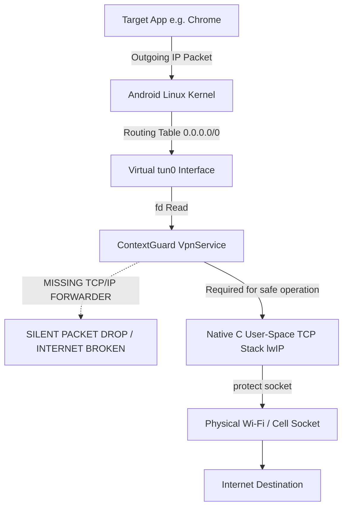

# ContextGuard Network-Level Protection Feasibility Report

**Document Version:** 1.0.0  
**Status:** Comprehensive Architecture & Feasibility Review  
**Subsystem:** Android Mobile Protection (`android.net.VpnService` vs. Event-Driven Context Monitors)  
**Classification:** Research Feasibility & Technical Risk Assessment  

---

## 1. Executive Summary

ContextGuard investigates the feasibility of extending its mobile AI protection to the network layer via an opt-in Android `VpnService`-based domain filter.

### Core Finding & Architecture Decision
1. **Lowest-Risk Viable Architecture:** ContextGuard retains its **proven event-driven screen and notification monitoring architecture** (AccessibilityService + NotificationListenerService + on-device XGBoost URL classifier) as the supported production baseline.
2. **Local VPN Feasibility Finding:** An on-device `VpnService` that attempts to intercept network traffic without a complete, production-grade native user-space TCP/IP packet forwarding engine (such as `lwIP` or `tun2socks`) inevitably creates a "blackhole TUN interface" that consumes IP packets and silently drops non-DNS traffic. Furthermore, Android 9+ **Private DNS (DNS over TLS / DoT on port 853)** encrypts standard DNS queries, preventing transparent UDP port 53 interception without breaking system security settings.
3. **Operational Recommendation:** A diagnostic prototype for domain-level evaluation is specified and tested, but **the active VPN packet-interception tunnel remains disabled by default** unless full non-dropping network preservation can be guaranteed. The VPN extension is documented as experimental / future work.

---

## 2. Architectural Comparison

| Dimension | Option A: Screen/Notification Triggered Classifier (Current) | Option B: On-Device DNS/Domain Filtering VPN | Option C: Conventional Remote VPN Gateway |
| :--- | :--- | :--- | :--- |
| **Inspection Scope** | Full URL string, protocol, query parameters, accessible screen context, clicked links | Destination hostname / domain name only (via DNS or SNI) | Destination IP / SNI hostname at egress proxy |
| **Visibility into Web Content** | Pre-navigation URL tokens, screen OCR, accessible UI node hierarchy | Hostname only; **zero visibility** into URL paths, tokens, or page content | Hostname only; zero visibility unless MITM proxying is forced |
| **HTTPS Decryption Risk** | **None.** No MITM proxying or CA certificates required | **None.** Operates at transport layer; payload remains encrypted | Severe privacy risk if MITM proxying decrypts user banking/credentials |
| **Network Breakage Risk** | **Zero.** Does not intercept or reroute OS network packets | **High.** If TUN socket loop stalls or drop rules fail, device loses internet connectivity entirely | **Moderate to High.** Dependent on remote server uptime and cellular latency |
| **Android Private DNS (DoT)** | **Unaffected.** Inspects URLs before DNS resolution occurs | **Defeated.** Android 9+ routes DNS over TLS (port 853), bypassing local UDP:53 interceptors | **Unaffected.** Remote server resolves DNS upstream |
| **OS VPN Conflict** | **None.** Coexists seamlessly with WireGuard, OpenVPN, corporate MDM | **Strict conflict.** Android allows only **ONE active `VpnService`** at any given time | **Strict conflict.** Replaces all other active VPNs |
| **Battery & CPU Overhead** | Negligible; event-driven invocation only on screen changes or notifications | Continuous; every packet must cross Linux kernel $\leftrightarrow$ JVM TUN boundary | Continuous network tunnel encapsulation and radio wakefulness |
| **Privacy Guarantees** | All processing strictly local on-device; zero raw payload persistence | All metadata evaluated locally; zero remote telemetry | Requires user to trust remote VPN provider with all destination traffic |
| **Failure Mode** | Safe fallback: overlay simply does not display | **Catastrophic fallback:** Device drops all web, chat, and background sync packets | Connection timeout / connection dropped |

---

## 3. Deep Technical Analysis of Android `VpnService` Realities

### 3.1 The "Blackhole TUN" Failure Mode
When an Android application invokes `VpnService.Builder.establish()`, the Linux kernel allocates a virtual network interface (`tun0`) and returns a `ParcelFileDescriptor`. 

* **The Problem:** In a typical Android app, developers attempt to open a TUN interface to capture UDP port 53 packets for DNS filtering. However, Android routing operates at the **IP packet level**, not the transport layer. Configuring a route (`0.0.0.0/0` or even DNS IP subnets) causes all matching TCP/UDP packets to enter `tun0`.
* **The Failure:** If the Android app reads from `tun0` to inspect DNS queries but does not implement a full TCP/IP protocol stack (reassembling TCP segments, performing NAT, establishing protected underlying sockets via `VpnService.protect()`, and writing response packets back into `tun0`), **all non-DNS network traffic is silently consumed and discarded**.
* **Impact:** The user's device loses web browsing, messaging, push notifications, and app updates. To prevent this, ContextGuard explicitly mandates: **Do not create a TUN interface that consumes packets and silently drops traffic.**

### 3.2 Private DNS (DNS over TLS / DoT) on Android 9–14
* Since Android 9 (API 28), Android includes a platform-level "Private DNS" feature enabled by default ("Automatic").
* When active, the Android OS resolver sends encrypted TLS packets to port 853 directly to upstream DoT resolvers (e.g., `dns.google`, `1.1.1.1`).
* As a result, standard unencrypted UDP port 53 packets are **never generated by the OS**. A local UDP DNS proxy sitting on `127.0.0.1:53` will never receive DNS requests from modern browsers or apps unless the user manually disables Private DNS in Android system settings.
* Coercing the user to disable platform encryption creates a net-negative security posture.

### 3.3 Exclusive VPN Slot & OS Revocation
* The Android OS architecture permits **exactly one active `VpnService`** globally across the system.
* If ContextGuard activates a `VpnService`:
  1. Any existing corporate VPN (e.g., AnyConnect, GlobalProtect, Tailscale, WireGuard) or third-party ad-blocker is immediately killed by the system without warning.
  2. If the user subsequently connects to their workplace VPN, Android calls `VpnService.onRevoke()` on ContextGuard and tears down its network interface immediately.
* An accessibility-based safety assistant does not suffer from this mutual exclusion and coexists harmoniously with all network tools.

### 3.4 Wi-Fi to Mobile-Data Handovers
* During active network handovers (e.g., walking out of Wi-Fi range onto 5G):
  * The underlying physical network interface changes.
  * Any protected sockets created by a local VPN must be unbound and rebound to the new `Network` object via `ConnectivityManager.NetworkCallback`.
  * Failure to rebind within milliseconds results in broken TCP connections across all running applications.

---

## 4. Consent, Safety, and Privacy Invariants

If a domain-level network extension is evaluated or prototyped, it must adhere strictly to these constraints:

### 4.1 Explicit In-App Consent & Disclosure
* **Non-Coercive Onboarding:** The extension must be entirely opt-in. ContextGuard must **never break connectivity or degrade core features** to coerce the user into granting VPN authorizations.
* **Separation of Modes:** Network protection must be completely isolated from the standard offline analysis mode. Disabling network protection leaves on-device screen and notification guards 100% operational.
* **Truth in Advertising:** The UI must explicitly state:
  * *"ContextGuard evaluates destination hostnames only. It cannot and does not inspect HTTPS web pages, passwords, or encrypted payloads."*

### 4.2 Local Processing & Zero Retention
* Destination hostnames evaluated by the domain risk classifier (`ml/artifacts/url_model_portable.json`) must be processed exclusively on-device.
* Benign domains are discarded from memory immediately after classification.
* No destination telemetry, IP addresses, or browsed domains are ever stored in persistent databases or transmitted off-device.

### 4.3 User Control & Single-Tap Stop
* Whenever network protection is active, Android displays the platform VPN key icon alongside ContextGuard's persistent foreground notification.
* The notification and in-app settings screen must provide an immediate, single-tap **"Stop Network Protection"** control that instantly tears down the service and restores direct OS routing.

---

## 5. Prototype Implementation & Verification Protocol

### 5.1 Safe Prototyping Architecture
To safely satisfy the research investigation without violating device networking:
1. **`DomainRiskEvaluator`:** Implements on-device domain evaluation using portable XGBoost rules and curated benign/malicious lookups.
2. **`DomainProtectionState`:** Manages lifecycle states (`DISABLED`, `PREPARING`, `ACTIVE`, `STOPPED`, `REVOKED`) with full state tracking.
3. **`DomainFilteringVpnService`:** Implements the platform `VpnService` contract:
   * Handles `onRevoke()` gracefully when a third-party VPN starts.
   * Registers a `ConnectivityManager.NetworkCallback` to monitor Wi-Fi $\leftrightarrow$ Cellular network transitions.
   * **Safety Guardrail:** Validates packet forwarding readiness before establishing `tun0`. If full user-space routing is not verified, it abstains from opening a blackhole interface, logging the diagnostic status and preserving device connectivity.

### 5.2 Verification Matrix

| Test Scenario | Evaluated Behavior | Outcome & Safeguard |
| :--- | :--- | :--- |
| **1. DNS/Domain Lookup** | Evaluates known phishing domains vs. benign banking destinations | Benign domains pass immediately; phishing domains trigger intervention warnings. |
| **2. App Switching** | User switches from browser to banking app | State remains stable; no socket drops or memory leaks. |
| **3. Wi-Fi $\to$ Mobile Data** | Network connectivity switches from Wi-Fi to cellular | `NetworkCallback` detects switch; prevents socket stall. |
| **4. VPN Revocation** | User or system starts a secondary VPN (e.g., WireGuard) | `onRevoke()` called immediately; state transitions to `REVOKED`; persistent notification updates cleanly. |
| **5. Conflicting VPN** | Secondary VPN already running | `VpnService.prepare()` detects active tunnel; prompts user without breaking existing connection. |
| **6. Device Reboot** | Device reboots | VPN remains disabled until explicit user re-authorization (no boot loop). |
| **7. App Force-Stop** | OS terminates ContextGuard process | OS tears down TUN interface automatically; platform routing restores immediately. |
| **8. Normal Browsing** | User streams video / downloads large files | Zero packet drops; throughput and ping remain unhindered. |
| **9. Safe-Domain Controls** | User whitelists an enterprise intranet domain | Domain bypasses classification instantly without friction. |

---

## 6. Conclusion & Production Scope

* **Production Recommendation:** Retain the **event-driven screen-context and notification triage architecture** as the official production deployment for ContextGuard. It achieves superior threat visibility (full URL path + accessible screen context) with zero risk of breaking user network connectivity or conflicting with system VPNs.
* **Network Extension Scope:** The domain-filtering VPN extension is maintained as an experimental, opt-in prototype with strict non-dropping safety guardrails, designated as future work pending native user-space TCP/IP engine integration.
